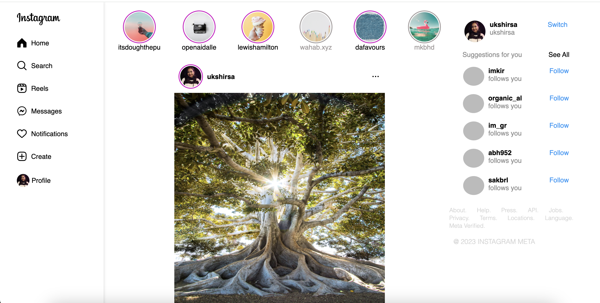

# Instagram Clone

## Project Overview

This project involves creating a web-based clone of Instagram using HTML and CSS. The primary components of the clone include:

- **Sidebar**: A simple sidebar featuring icons and a list structure using `<ul>` and `<li>` tags. This element is styled using CSS to fix its position and maintain its width.
- **Story Section**: Utilizes Flexbox to display a row of stories. Each story is a combination of an image and text, formatted to appear as circular icons with captions.
- **Posts Section**: Another Flexbox layout that is more intricate. This section displays individual posts with images, user interactions (like, comment, share), and comments.
- **Footer Section**: Contains user details, suggestion lists, and navigational links. Styled to stay at the bottom of the page.

## Image of index.html


## Table of Contents

- [Project Overview](#project-overview)
- [Features](#features)
- [Technologies Used](#technologies-used)
- [Installation](#installation)
- [Usage](#usage)
- [Folder Structure](#folder-structure)
- [Contributing](#contributing)
- [License](#license)
- [Contact](#contact)

## Features

- **Fixed sidebar with navigation icons**
- **Story section with circular images and captions**
- **Posts section displaying images, interactions (like, comment, share), and comments**
- **Footer section with user details and suggestions**

## Technologies Used

- **HTML**
- **CSS (Flexbox for layout)**

## Installation

To get a local copy of the project up and running, follow these steps:

1. **Clone the repository:**

   ```bash
   git clone https://github.com/your-username/instagram-clone.git
   
2. **Navigate to the project directory:**

   ```bash
   cd instagram-clone
## Usage

Open the index.html file in your favorite web browser to view the Instagram clone.


   
